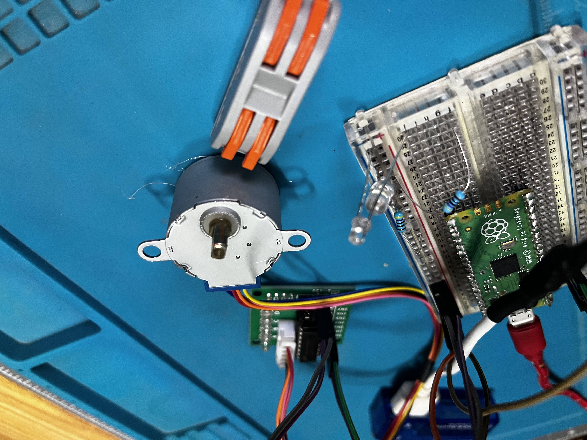
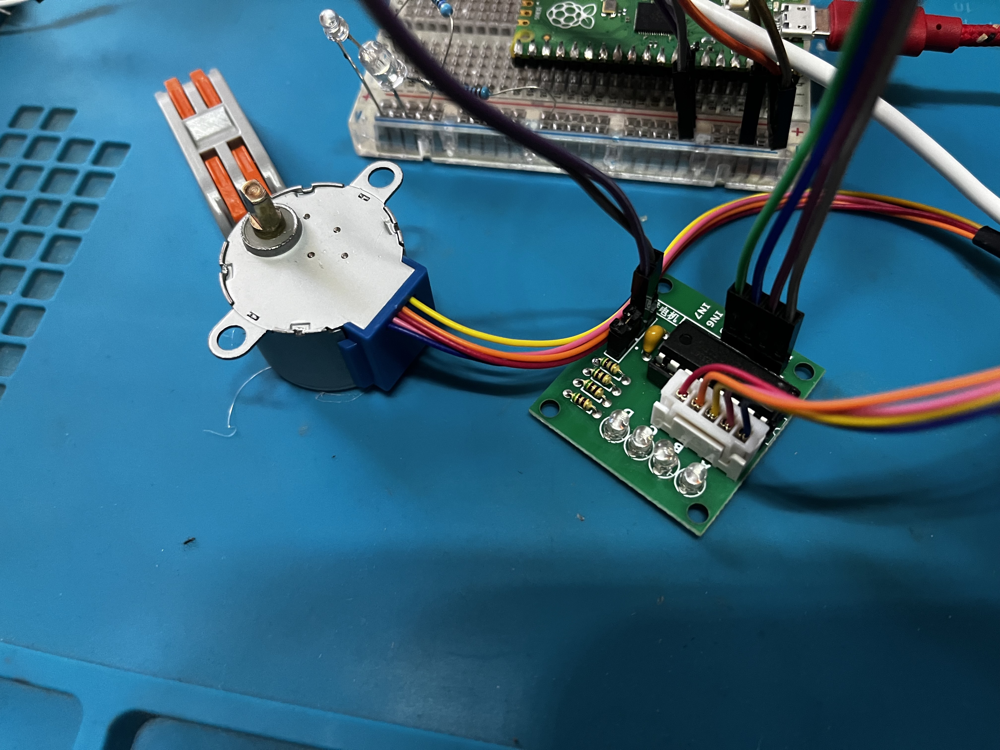

# Demo para usar Stepper 28BYJ-48 con ULN2003

Este repositorio incluye una librería para controlar el motor paso a paso 28BYJ-48 con el driver ULN2003.

Se ha preparado para ser usado con micropython en una placa ESP32 o raspberry pi pico principalmente.

También incluye un ejemplo de uso.

## Información

Dentro de "Models" se encuentra la clase para el Stepper que permite controlar el motor paso a paso.

Las posibilidades de control son:
- Velocidad de giro
- Dirección de giro
- Mover un número de pasos concreto indicando los grados
- Iniciar un movimiento continuo

## Pinout

El pinout por defecto es el siguiente:

- IN1: GPIO 2
- IN2: GPIO 3
- IN3: GPIO 4
- IN4: GPIO 5

## Alimentación

El motor que yo he utilizado se alimenta con 5V y consume aproximadamente:

- 50mA En velocidad mínima
- 80mA En velocidad media
- 160mA En velocidad máxima

Hay que tener en cuenta, que si alimentamos el controlador/motor desde una fuente externa TENEMOS que poner siempre tierra en común (GND).

## Disclaimer

Este repositorio es un proyecto personal, no está pensado para ser usado en producción. Si lo usas, hazlo bajo tu responsabilidad.

He intentado documentar todo lo que he podido, pero si tienes alguna duda, puedes abrir un issue y te responderé lo antes posible.

También puedes abrir PR si quieres aportar algo al proyecto.

Este proyecto ha sido realizada en un streaming en directo en mi canal de [Twitch](https://www.twitch.tv/raupulus) y de [Youtube](https://www.youtube.com/@raupulus). Lo que puede tener partes que no sean las mejores formas.

## Licencia

Este proyecto está bajo la licencia GPLv3.

Puedes ver el archivo de licencia [aquí](LICENSE).
